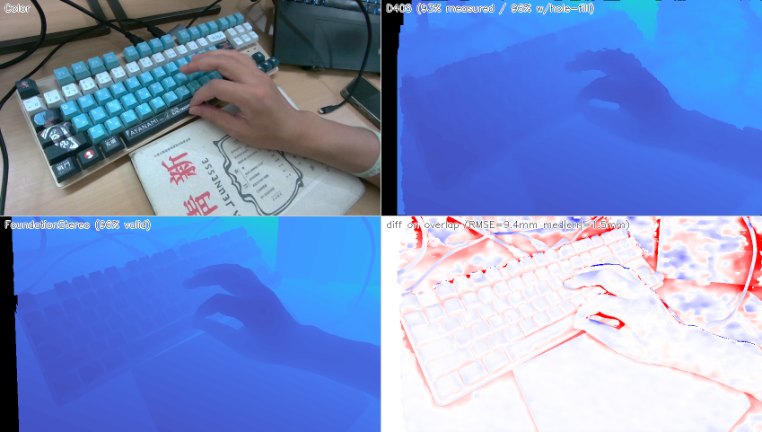
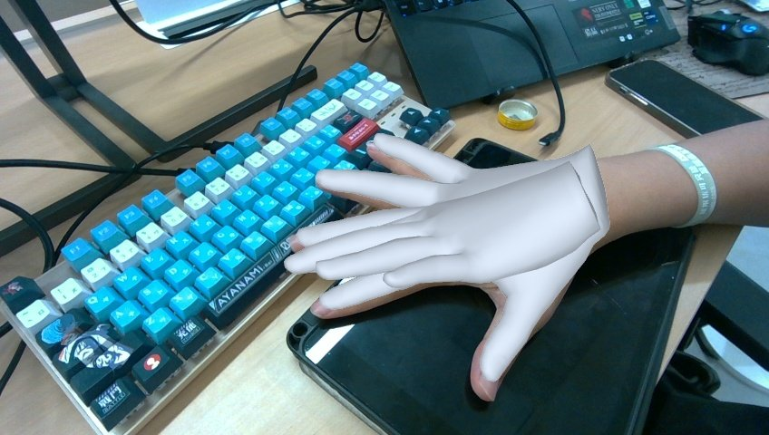
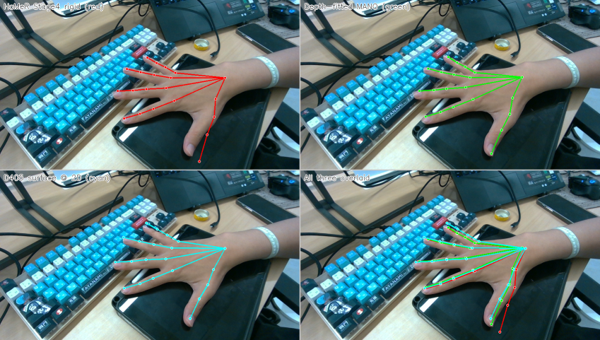

# d405_demo — Hand Identification Pipeline with Intel RealSense D405

End-to-end scripts that turn an Intel RealSense **D405** stream into a
personalized hand model, using **FoundationStereo** for dense depth and
**HaMeR** for monocular MANO regression, then refining MANO parameters
against D405's measured depth.

This implements Stage 1–4 (and parts of Stage 5) of the parent
[../readme.md](../readme.md):

```
D405 capture ──► stereo IR + depth + color ──► FoundationStereo (compare)
                                          └──► HaMeR (RGB → MANO)
                                                    │
                                                    ▼
                                       Stage 4 depth-refined MANO
                                                    │
                                                    ▼
                                       (next) Stage 5 bone-length fit
```

---

## Example results

Three artifacts from running the full pipeline on a hand-on-keyboard scene
captured at ~25 cm. All three images live under [image/example_results/](image/example_results/).

### 1. FoundationStereo vs D405 native depth — they agree to ~1.5 mm on the median

`compare_fs_d405.py` runs FoundationStereo on the IR pair and stacks its
depth next to D405's measurement-only depth. Top-left: input color. Top-right:
D405's native filtered depth. Bottom-left: FoundationStereo. Bottom-right:
signed difference (red = FS reports farther, blue = closer, white = match).



```
Coverage:
  D405 actually measured :  92.72 %      (emitter OFF, textured scene)
  D405 with hole-filling :  95.51 %
  FoundationStereo       :  95.93 %
  comparison overlap     :  92.72 %

Errors on overlap (FS - D405):
  bias       :   +1.18 mm
  mean |err| :    4.20 mm
  median|err|:    1.50 mm
  RMSE       :    9.36 mm
```

The 1.5 mm median tells the real story: on the half of pixels where both
methods agree most, they're within sensor noise. The 9 mm RMSE is the
tail from a few edge pixels.

### 2. HaMeR's MANO mesh, projected onto the color image

`infer_hamer.py` runs HaMeR on `color.png` and produces a rendered overlay
along with `mano_hand_<i>.npz` (β, θ, 778 vertices, 21 joints).



The "white glove" you see is the 778-vertex MANO mesh re-rendered through
HaMeR's *virtual* camera (focal ≈ 16562 px). The fit is visually good in
2D — but HaMeR places the hand at Z ≈ 8.7 m in 3D, ~30× too far. The next
two steps fix that.

### 3. Stage 4 rigid shift vs depth-fitted MANO — 2× tighter to the surface

`fit_mano.py` optimizes (β, θ, global_orient, T) so MANO's 21 joints match
D405's depth at all 21 projected pixels. Top-left: HaMeR + rigid wrist shift
(red). Top-right: depth-fitted MANO (green). Bottom-left: D405 surface
back-projected at the 21 HaMeR pixels (cyan, *no kinematic constraints*).
Bottom-right: all three overlaid.



| Comparison | mean 3D distance | max |
|---|---|---|
| Stage 4 (rigid) vs depth-fitted | 11.66 mm | 14.24 mm |
| Stage 4 (rigid) vs D405 surface | 15.72 mm | 53 mm |
| **depth-fitted vs D405 surface** | **8.00 mm** | 41 mm |

Depth fitting halves the gap to D405's surface (16 mm → 8 mm). The residual
8 mm is dominated by the fundamental "joint center inside the finger vs.
skin surface outside" offset that ~no method can eliminate.

> **Why is the cyan ("D405 measured") skeleton visually closest to the
> hand?** Because it has *no kinematic constraints* — each of the 21 cyan
> points is the D405 surface depth at exactly that 2D pixel. They look
> pasted-on but the "bones" between them are not real bone lengths and
> can't be used to fit a personalized skeleton. The green MANO joints sit
> inside the finger (where bones actually are) and preserve consistent
> bone lengths — that's what Stage 5 needs.

---

## Two Python environments are needed

| Env                                             | What's in it                                                               | Used by                                                           |
| ----------------------------------------------- | -------------------------------------------------------------------------- | ----------------------------------------------------------------- |
| `foundation_stereo` (conda)                   | torch 2.4.1+cu121, xformers, flash-attn 2.6.3, open3d, pyrealsense2 2.57.7 | All `capture_*`, `compare_*`, `fuse_*`, `depth_to_pcd.py` |
| `.hamer` (venv at `/home/yy/hamer/.hamer/`) | torch 2.5.1+cu121, detectron2 0.6, smplx, HaMeR repo                       | `infer_hamer.py`, `fit_mano.py`                               |

The two stages don't share an env because HaMeR was set up earlier with a
different torch version, and reinstalling either is more painful than
swapping shells.

### Activate the right one

```bash
# For capture / FoundationStereo / fusion / point cloud:
conda activate foundation_stereo

# For HaMeR / MANO fitting:
source /home/yy/hamer/.hamer/bin/activate
```

---

## Scripts by stage

| # | Script                                    | Env                   | What it does                                                                                                                                                                                                                                                                                   |
| - | ----------------------------------------- | --------------------- | ---------------------------------------------------------------------------------------------------------------------------------------------------------------------------------------------------------------------------------------------------------------------------------------------- |
| 0 | [`list_streams.py`](list_streams.py)       | `foundation_stereo` | Enumerate every stream profile the camera advertises. Diagnostic.                                                                                                                                                                                                                              |
| 0 | [`preview_streams.py`](preview_streams.py) | `foundation_stereo` | Live preview of color + depth + IR with the full filter chain.                                                                                                                                                                                                                                 |
| 1 | [`capture_stereo.py`](capture_stereo.py)   | `foundation_stereo` | **Press SPACE to snap a frame.** Saves `left/right.png` (IR pair, BGR-stacked), `color.png`, `depth_d405.npy` (post-hole-filling, float32 m), `depth_d405_measured.npy` (pre-hole-filling — the "actually measured" mask), `K.txt`. **Press E** to toggle IR projector. |
| 1 | [`record_sequence.py`](record_sequence.py) | `foundation_stereo` | **Press SPACE to start/stop recording.** Captures a continuous sequence of frames into `sequences/<ts>/frames/NNNNNN/`. Used by `fuse_sequence.py`.                                                                                                                                  |
| 2 | [`compare_fs_d405.py`](compare_fs_d405.py) | `foundation_stereo` | Run FoundationStereo on `left/right.png`, then compare its depth with D405's native depth pixel-by-pixel. Outputs a 4-panel `comparison.png` + RMSE / bias / coverage stats.                                                                                                               |
| 2 | [`depth_to_pcd.py`](depth_to_pcd.py)       | `foundation_stereo` | Reproject the saved depth maps into colored point clouds (`cloud_d405.ply` + `cloud_fs.ply`). With `--show`, opens an Open3D viewer where **D/F/1/2/3** toggle which cloud is visible.                                                                                             |
| 2 | [`fuse_sequence.py`](fuse_sequence.py)     | `foundation_stereo` | RGBD-odometry + TSDF integration over a recorded sequence → single fused mesh + colored point cloud. For multi-view reconstruction of static scenes.                                                                                                                                          |
| 3 | [`infer_hamer.py`](infer_hamer.py)         | **`.hamer`**  | Run HaMeR on a capture's `color.png`. Saves complete MANO output (β, θ, global_orient, 778 vertices, 21 joints in HaMeR-frame and D405-frame). Also does the simple **Stage 4 rigid shift**: replaces HaMeR's wrong monocular Z with D405's measurement at the wrist 2D pixel.       |
| 4 | [`fit_mano.py`](fit_mano.py)               | **`.hamer`**  | The "real" Stage 4: optimizes (β, θ, global_orient, T) so MANO's 21 joints match D405's depth at all 21 projected 2D positions — not just the wrist. Uses differentiable MANO forward (smplx) + grid_sample.                                                                                |

---

## Typical workflow

### Snap a single frame and run the whole stack

```bash
# 1. Snap a frame
conda activate foundation_stereo
cd /home/yy/dex_ws/hand_identification_demo/d405_demo
python capture_stereo.py
# point camera at your hand 20-30cm away → SPACE to save → Q to quit
# output: captures/<ts>_em{ON,OFF}/

# 2. Compare FoundationStereo depth vs D405 native depth
python compare_fs_d405.py --latest
# output: <capture>/comparison.png + comparison_stats.txt + fs_depth.npy

# 3. Generate colored point clouds and inspect interactively
python depth_to_pcd.py --latest --show
# D=toggle D405, F=toggle FS, 1/2/3=view

# 4. Switch envs and run HaMeR
deactivate                                 # leave foundation_stereo
source /home/yy/hamer/.hamer/bin/activate
PYTORCH_CUDA_ALLOC_CONF=expandable_segments:True \
  python infer_hamer.py captures/<ts>_emOFF
# output: <capture>/hamer_out/mano_hand_<i>.npz + .obj + overlay

# 5. Depth-refine MANO using all 21 joint depths
python fit_mano.py captures/<ts>_emOFF --fix-betas
# output: <capture>/hamer_out/mano_hand_<i>_fitted.npz + .obj
```

### Record a multi-view sequence and fuse into one 3D model

```bash
conda activate foundation_stereo
python record_sequence.py
# SPACE to start recording; move camera slowly around the object; SPACE to stop
# output: sequences/<ts>_em{ON,OFF}/frames/NNNNNN/

python fuse_sequence.py --latest --show
# RGBD odometry + TSDF fusion (~2 min for 150 frames)
# output: <sequence>/fused_mesh.ply + fused_cloud.ply + trajectory.npy
```

---

## Data layout

```
captures/<YYYYMMDD_HHMMSS>_em{ON,OFF}/
├── left.png              IR1 (BGR-stacked, what FoundationStereo wants)
├── right.png             IR2 (BGR-stacked)
├── color.png             RGB color stream (aligned to IR1 frame)
├── depth_d405.npy        (H, W) float32, meters, AFTER hole-filling
├── depth_d405_measured.npy  same but BEFORE hole-filling (use this for stats)
├── depth_d405_raw.png    raw Z16 16-bit PNG (no filters)
├── depth_d405_vis.png    colorized depth for eyeballing
├── K.txt                 line 1: 3×3 K row-major; line 2: baseline (m)
├── meta.txt              emitter state, depth_scale, FPS, etc.
│
│  ── after compare_fs_d405.py ──
├── fs_depth.npy          (H, W) FoundationStereo depth in meters
├── comparison.png        4-panel: color | D405 | FS | diff
├── comparison_stats.txt  coverage %, bias, RMSE in mm
│
│  ── after depth_to_pcd.py ──
├── cloud_d405.ply        D405 measurement-only point cloud
├── cloud_fs.ply          FoundationStereo point cloud
│
│  ── after infer_hamer.py ──
└── hamer_out/
    ├── mano_hand_<i>.npz       21 arrays: HaMeR β/θ/joints/verts + Stage 4 refs
    ├── mano_hand_<i>.obj       MANO mesh in HaMeR cam frame
    ├── overlay_with_mano.jpg   rendered overlay
    │
    │  ── after fit_mano.py ──
    ├── mano_hand_<i>_fitted.npz   refined β/θ/T + final joints + final verts
    └── mano_hand_<i>_fitted.obj

sequences/<YYYYMMDD_HHMMSS>_em{ON,OFF}/
├── K.txt
├── meta.txt              frame_count, fps, duration
└── frames/000000/, 000001/, ...
    └── color.png + depth.png + depth.npy + left.png + right.png
```

---

## Things to know that are not obvious

1. **D405 cannot give stereo color.** The "infrared bgr8" profiles in
   `list_streams.py` are aliases of the single color stream; only the left
   sensor exposes RGB. Stereo IR is mono-only (Y8). `capture_stereo.py` is
   built around this — IR pair as Y8 + replicated to BGR at save time so
   FoundationStereo's demo accepts it. See [../FoundationStereo/scripts/run_demo.py](../FoundationStereo/scripts/run_demo.py).
2. **`ALL_PROXY=socks://...` breaks FoundationStereo.** httpx and torch.hub
   can't parse the socks scheme. Always launch FS inference with
   `env -u ALL_PROXY -u all_proxy python ...`. Pure-USB scripts
   (`preview_streams.py`, `capture_stereo.py`, `record_sequence.py`)
   are unaffected.
3. **DINOv2 cache is patched.** `FoundationStereo/depth_anything/dpt.py:153`
   was edited to load DINOv2 from the local `torch.hub` cache rather than
   re-validating against GitHub on every inference (which fails through the
   socks proxy). If you ever `git pull` FoundationStereo, re-apply this edit
   or you'll get `RemoteDisconnected` errors.
4. **HaMeR's MANO Z is wrong by 30×.** HaMeR uses a virtual focal length of
   ~16562 px, so it places the hand at ~8.7 m to match the input bbox size.
   That's why we need Stage 4. The 2D projection in the image is still
   accurate — it's only the absolute depth that's off.
5. **The IR projector matters.** `capture_stereo.py` starts with emitter
   ON (D405's intended mode — needed for native SGBM depth on textureless
   regions). Press **E** to toggle. For FoundationStereo-only comparisons
   you may want emitter OFF (projector dots can confuse learning-based
   stereo); for fair D405-vs-FS comparisons, leave it ON.
6. **`realsense-viewer` and `conda` don't mix.** Inside `foundation_stereo`,
   `LD_LIBRARY_PATH` shadows the system `libglfw.so` with an older one
   that lacks `glfwGetError`. Run with `LD_LIBRARY_PATH= realsense-viewer`
   or `conda deactivate` first.
7. **HaMeR sometimes hallucinates extra hands.** If `infer_hamer.py`
   reports more hands than are actually visible, the spurious detections
   will have bad `joints_2d_pixel` and the resulting fit will be garbage
   (depth_rms > 20 mm, 2D_rms > 30 px). Compare each detection against
   the actual image before trusting it. A confidence-based filter is on
   the TODO list.

---

## What's not here yet

- **Stage 5 bone-length fit.** Combine N captures' `mano_hand_<i>_fitted.npz`
  to compute per-bone median lengths → personalized 20-bone skeleton.
- **Multi-frame β-sharing.** Optimize a single β across all captures of the
  same hand while letting θ and T vary per frame.
- **MediaPipe-format export.** Convert the personalized model into MediaPipe's
  21-landmark / 20-bone JSON format for downstream use.
